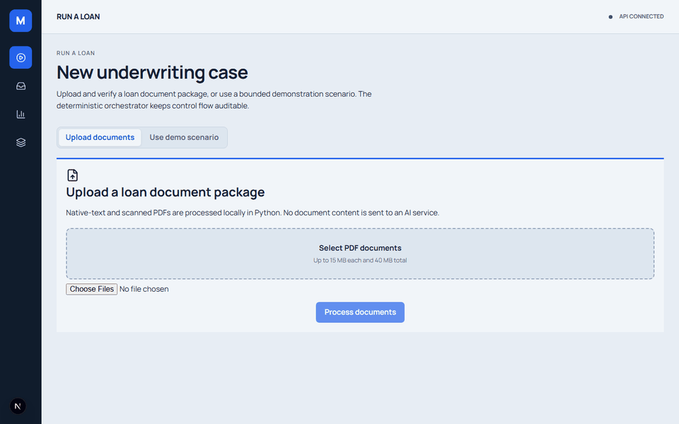
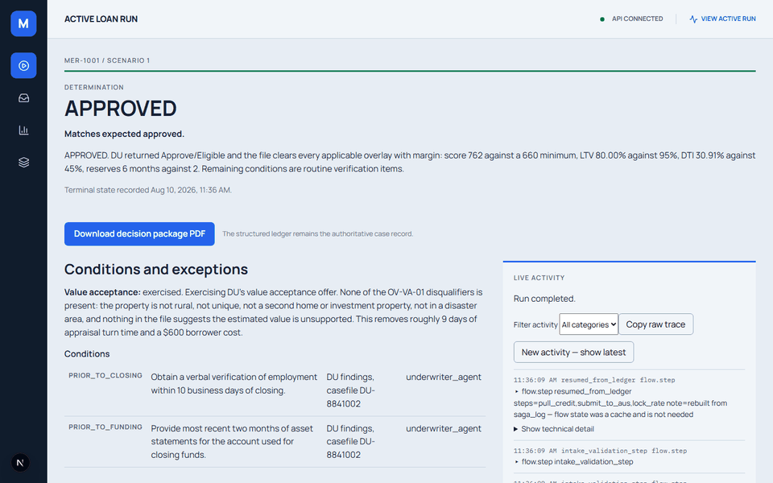
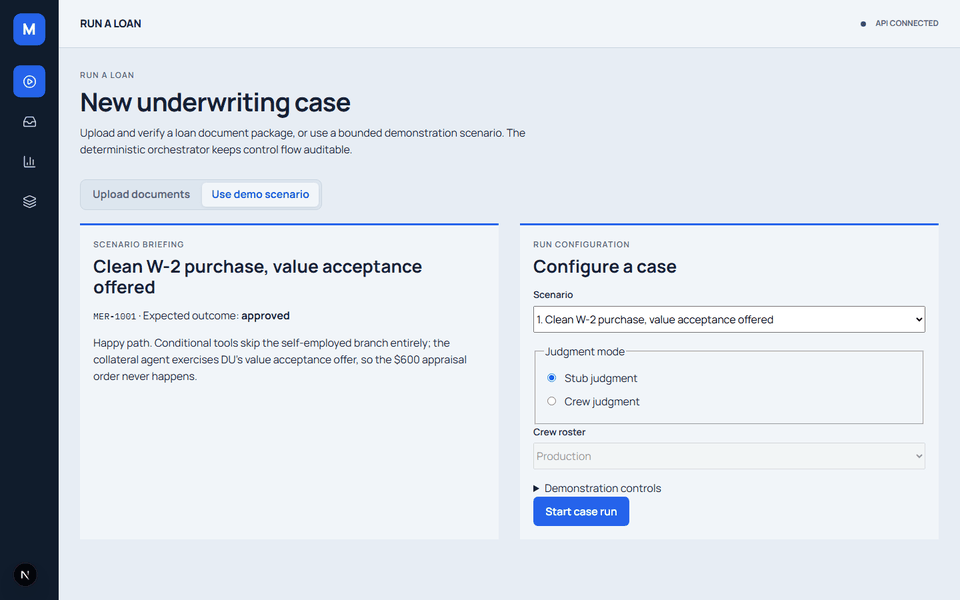

# MERIDIAN

**Agentic loan origination for home lending.** Three production LLM agents, plus an eight-agent
demonstration roster, driven by a deterministic CrewAI Flow with a measured evaluation harness.

> A deterministic orchestrator owns control flow. LLM agents supply judgment inside it, and are
> never trusted with control flow, arithmetic, or irreversible side effects.

The modeled target is **roughly 14 manual touches to at most 2 named approval/review touches**, with
approval wait reported separately when a gate applies. Like-for-like automated-path estimates
remain 21 → 4 days with value acceptance and 30 → 13 days with a full appraisal; human queue time
is added on gated files. See [the assumptions](docs/assumptions.md).

## Quickstart

```bash
uv sync
uv run pytest tests/                                # Python test suite, no LLM
uv run python run_cli.py --scenario 3 --auto-approve # saga compensation, in reverse
uv run python evals/run_evals.py                    # five headline measures plus diagnostics
```

Runs with no API key: the deterministic `stub` judgment exercises the Flow, routers, saga, tool
gateway, Reg Z control, retrieval and citation verification. For agents, set an API key (see
[`.env.example`](.env.example)) and pass `--judgment crew --roster production`; use
`--roster demo` for the historical eight-agent configuration. Human gates pause by default;
`--auto-approve` is an explicitly labelled walkthrough/eval mode.

## Dashboard

The browser dashboard is a Next.js app backed by a thin FastAPI adapter over the same
application services `run_cli.py` uses. Run both processes (two terminals):



### Walkthroughs

**PDF intake.** Upload a borrower package, process it locally, and review the extracted facts before a case can start.


**Decision package.** Download the completed decision package and preview the generated PDF.


**AI results and evidence.** Review the approval result together with the citations and retrieved guideline evidence supporting it.



**Mortgage approval.** Choose the approved demonstration scenario and follow it through to its final determination.



```bash
uv run uvicorn meridian.api.app:app --host 127.0.0.1 --port 8000   # terminal 1 — API on :8000

cd frontend
npm ci                                                              # first time only
npm run dev                                                        # terminal 2 — UI on :3000
```

Open `http://localhost:3000`. The frontend reads `NEXT_PUBLIC_MERIDIAN_API_ORIGIN`/
`MERIDIAN_API_ORIGIN` (defaults to same-origin, i.e. a same-origin proxy in production) to
reach the API; CORS on the API side is restricted to `http://localhost:3000` unless
`MERIDIAN_CORS_ORIGINS` overrides it. See [Development](docs/development.md) for build/test
commands and [the frontend plan](docs/plan/nextjs-frontend/README.md) for the full migration
history.

To start both processes from one terminal instead, run:

```bash
cd frontend
npm run dev:stack
```

Pass `-- --demo` to enable the local-only auto-approval demonstration control.

## What to look at

```bash
uv run python run_cli.py --scenario 1               # value acceptance exercised — the $600 never happens
uv run python run_cli.py --scenario 2 --auto-approve # overlay exception; G2 is named in output
uv run python run_cli.py --scenario 3 --auto-approve # denial; G1 is named before notice/compensation
uv run python run_cli.py --scenario 4 --twice       # idempotency: bureau counter stays at 1
uv run python run_cli.py --scenario 1 --policy-attack   # the Reg Z gate under prompt injection

uv run python run_cli.py --scenario 5 --kill-after submit_to_aus   # kill mid-flow…
uv run python run_cli.py --scenario 5                             # …resume from the ledger alone
uv run python run_cli.py --ledger MER-1003          # reconstruct a loan by hand from saga_log
```

Omit `--auto-approve` to pause at an applicable gate, record a named decision in the dashboard's
approval queue, and rerun the loan to resume from the durable ledger.

## Architecture

The production system has **three LLM judgment agents**. The retained **1 + 4 + 2 + 1** shape is
available only with `--roster demo`; it demonstrates conditional tool menus and handoffs without
changing the deterministic control plane.

```text
                  +-------------------------------------------+
                  | OriginationFlow (CrewAI Flow)             |
                  | deterministic: @start/@listen/@router     |
                  | branches only over typed state             |
                  +--------------------+----------------------+
                                       |
                   +-------------------+-------------------+
                   |                                       |
                   v                                       v
    +-------------------------------+       +--------------------------------+
    | Production roster             |       | Demo roster (--roster demo)    |
    | 3 judgment agents             |       | 8 agents: 1 Intake, 4 Verify,  |
    | collateral, underwriter, QC   |       | 2 Underwrite, 1 Governance     |
    +-------------------------------+       +--------------------------------+
                   |                                       |
                   +-------------------+-------------------+
                                       |
                                       v
    +-------------------------------------------------------------------+
    | Deterministic calculations and external-effect boundary           |
    | tools.py: trace/count/classify calls                              |
    | core/saga.py + core/idempotency.py + core/policy.py: controls     |
    +--------------------------+----------------------------------------+
                               |                         |
                               v                         v
              +--------------------------+  +-------------------------------+
              | External services        |  | Local judgment support         |
              | credit, DU, AMC, pricing,|  | calculators and guideline RAG  |
              | VOE/VOD                  |  | (the LLM is not a vendor)      |
              +--------------------------+  +-------------------------------+
                               |
                               v
              +--------------------------------------------------+
              | meridian.db (SQLite WAL): authoritative state   |
              | loan_state, saga_log, idempotency, approvals,    |
              | notices, events, and intake-run records          |
              +--------------------------------------------------+

    evals/ golden set --> isolated per-case databases --> five headline measures + diagnostics
```

The Flow controls sequence; agents provide bounded judgment. External effects are routed through
the gateway and saga/policy layers, while the evaluation harness uses isolated databases rather
than the application's `meridian.db`. Full rationale: [architecture](docs/architecture.md).

## Documentation

| Doc | What's in it |
|---|---|
| [Architecture](docs/architecture.md) | Decomposition rule, the judgment seam, where it breaks, roadmap |
| [Agent rosters](docs/agents.md) | Three production agents and the retained eight-agent demo roster |
| [Reliability](docs/reliability.md) | Reg Z policy gate, idempotency, saga compensation, single source of truth |
| [Evaluation](docs/evaluation.md) | Golden set, five headline measures, plus cost/latency and retrieval diagnostics |
| [Roster comparison](evals/roster-comparison.md) | Controlled stub/production/demo comparison command and evidence status |
| [Assumptions](docs/assumptions.md) | Every cycle-time baseline, labelled measured or modeled |
| [Limitations](docs/limitations.md) | What this does not do |
| [Development](docs/development.md) | Setup, tests, layout, dashboard, browser checks |
| [Decision records](docs/adr/README.md) | Every architectural decision, with the code that evidences it |


## Tech

Python 3.10–3.13 · CrewAI · Pydantic · SQLite (WAL) · numpy · FastAPI · Next.js · pytest
